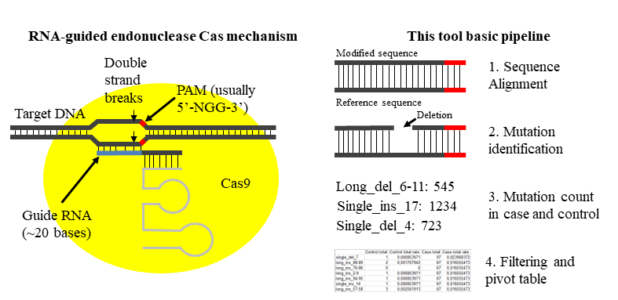

# Small_Indell_Analyzer
Tool that performs analysis of the short indels introduced by Cas endonuclease. 
<p align="center">
  
</p>


## Installation
To install this package, download it from this GitHub page (Code -> Download zip or git clone https://github.com/vikhall/Small_Indell_Analyzer.git). Then run the script Small_Indell_Analyzer.py from src directory in terminal (Linux) or command line (Windows) (python Small_Indell_Analyzer_new.py ....)

### Requirements
This package requires: 
* Python 3.6.0 or higher;
* Biopython 1.79 or higher;
* xlwt 1.3.0 or higher.

## Usage
```
Small_Indell_Analyzer_new.py [-h] [-w WORKDIR] [-o RESDIR] [-e EXCEL_FILE] 
                             [-b BAD_ALIGN_FILE] [-r REPORT_FILE] [-t ALIGN_QUAL_THRESHOLD] 
                             [-с COUNT_THRESHOLD] [-a ALT_ALLELE] [-f WRITE_FASTQ] 
                             [-m MUTATION_TO_WRITE] 
                             ref_seq case control pam pam_orient
```
```
positional arguments:

  ref_seq               Reference sequence to which all reads will be aligned. 
                        Might be string containing only A,T,G,C letters (in AnY cASe) or path to the fasta-file.
  case                  Fastq file with case reads. If only the file name is given, the file will be searched in the working directory.
  control               Fastq file with control reads. If only the file name is given, the file will be searched in the working directory.
  pam                   PAM sequence. This sequence is necessary for the correct numbering of mutations.
  pam_orient            Orientation of the PAM in the reference sequence. 
                        It can be "left" if mutations are located to the right of the pam sequence, 
                        or "right" if mutations are located to the left of the pam sequence 
                        Example: R/right/Right or L/left/Left
                        
options:

  -h, --help                    show this help message and exit
  -w, --workdir                 Working directory with fastq files. By default, all input files will be searched in this directory 
                                (if only filenames without path given).
                                Default: directory with this script
  -o, --resdir                  Directory to which results will be saved If --resdir==workdir, directory will not be created and results 
                                will be saved in current working directory. If only name of the directory given, the directory 
                                will be created in working directory. If path/to/directory given, the directory will be created in this path. 
                                If resdit not exist, it will be created. Default: Results
  -e, --excel_file              Excel file with main result. If only name of the file given, file with report will be created in workdir.
                                If path to the file given, excel will be written in this file (file will be created if not exist 
                                (otherwise, file will be overwritten)). Default: Mutations_+{Name of the case file}.xls
  -b, --bad_align_file          File with bad alignments (with score < align_qual_threshold). Default: None
  -r, --report_file             File with brief report. If only name of the file given, file with report will be created in workdir. 
                                If path to the file given, report will be written in this file (file will be created if not exist 
                                (otherwise, report will be written in the end of the existing file)).
                                Default: Report_+{Name of the control file}.txt
  -t, --align_qual_threshold    The threshold for the quality of alignments. Only alignments with a score higher 
                                than this value will be used to search for mutations. Default: 0
  -с, --count_threshold        Threshold of mutation frequency. Only mutations with a frequency higher
                                than this value will be saved after filtering Default: 3
  -a, --alt_allele              Short unique sequence containing alternative allele. If given, the mutation search will be performed
                                separately in the reads containing this allele. 
                                Must be short unique substring of the ref_seq, containing SNP. 
                                Example: "ATGCA", where G is SNP of interest. Nucleotides around G is      
                                needed to found this substring in ref_seq. Default: None
  -f, --write_fastq             If given (any string: yes/true etc), three groups of reads will be written in resdir:
                                aligned reads without mutations, aligned reads with mutations and not aligned reads 
                                (with score < align_qual_threshold). 
                                Default: None
  -m, --mutation_to_write       If given, reads with this mutation will be written in fastq-files.
                                Example: "--mutation_to_write=single_del_6". Default: None.
```
### Example

`python Small_Indell_Analyzer_new.py ATGATGCTTTATACCGGTGACACTGATGATTATATACAAGTGCAAA RbCas12a_12i_r1.fq RbCas12a_9i_r1.fq CAAA R -w /path/to/working/directory (D:\path\to\working\directory for Windows)`
